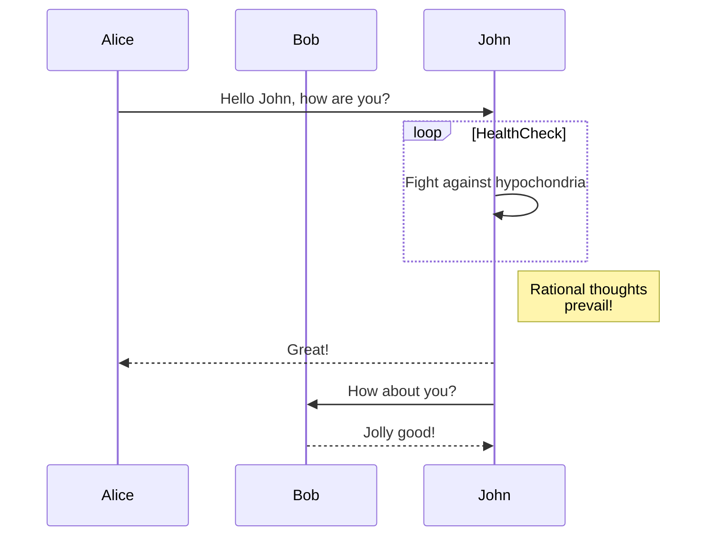
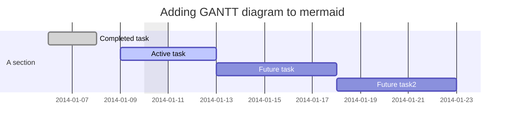
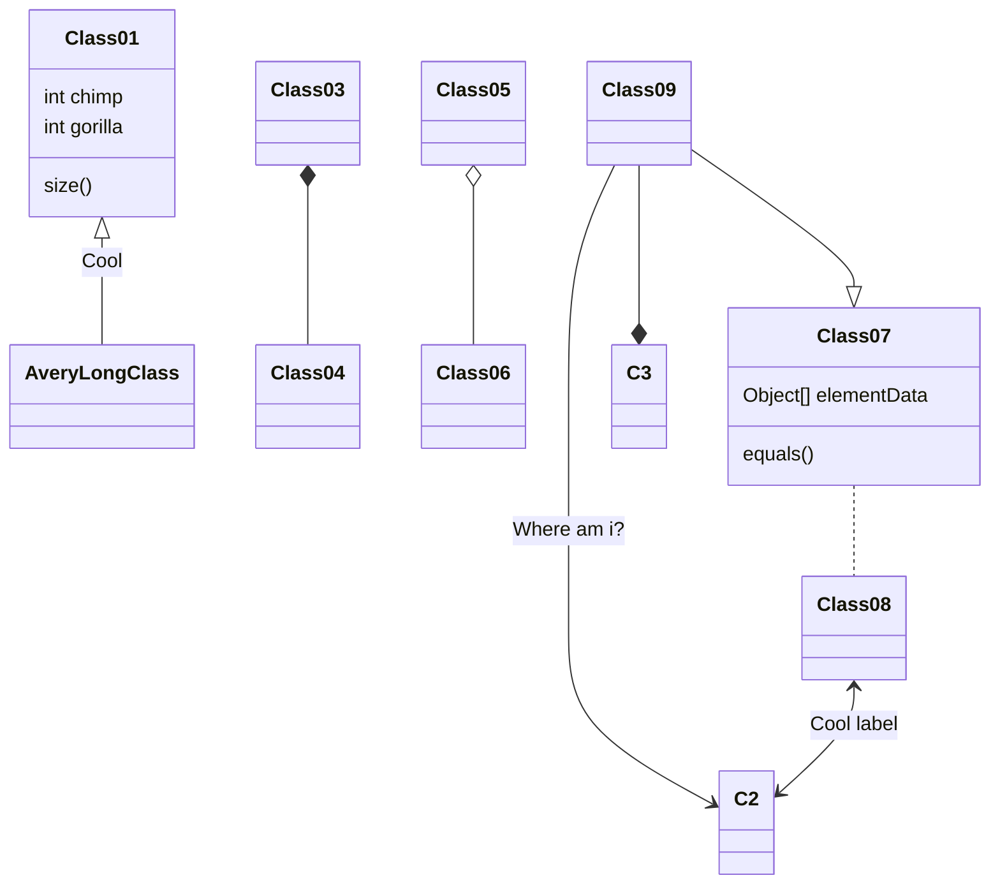
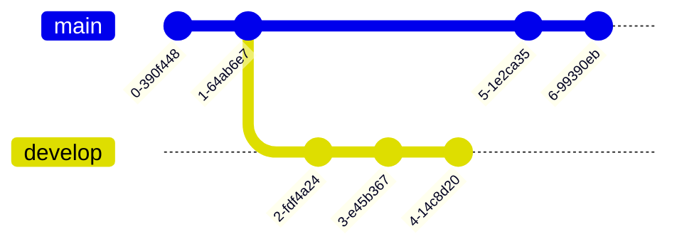
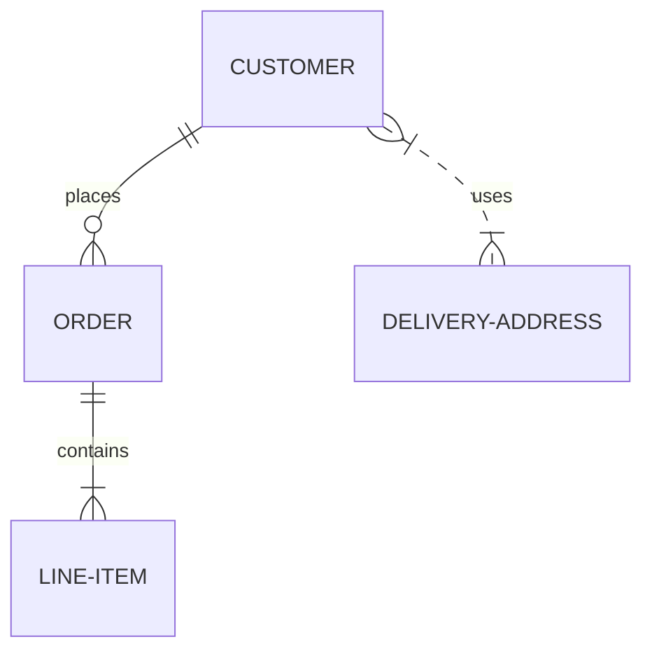
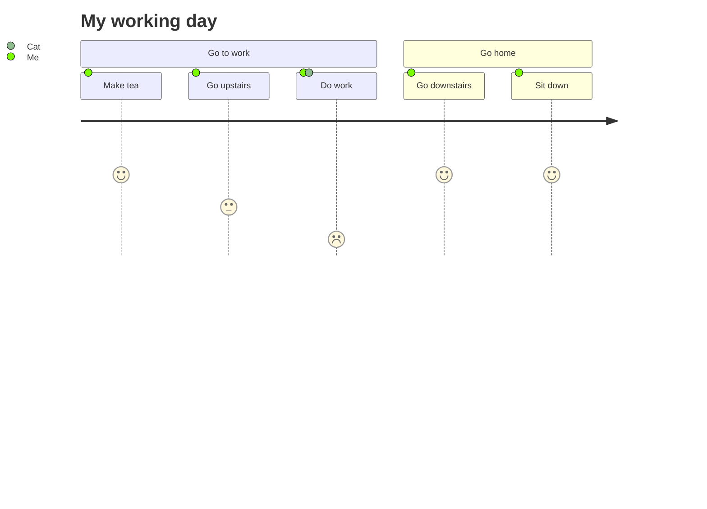
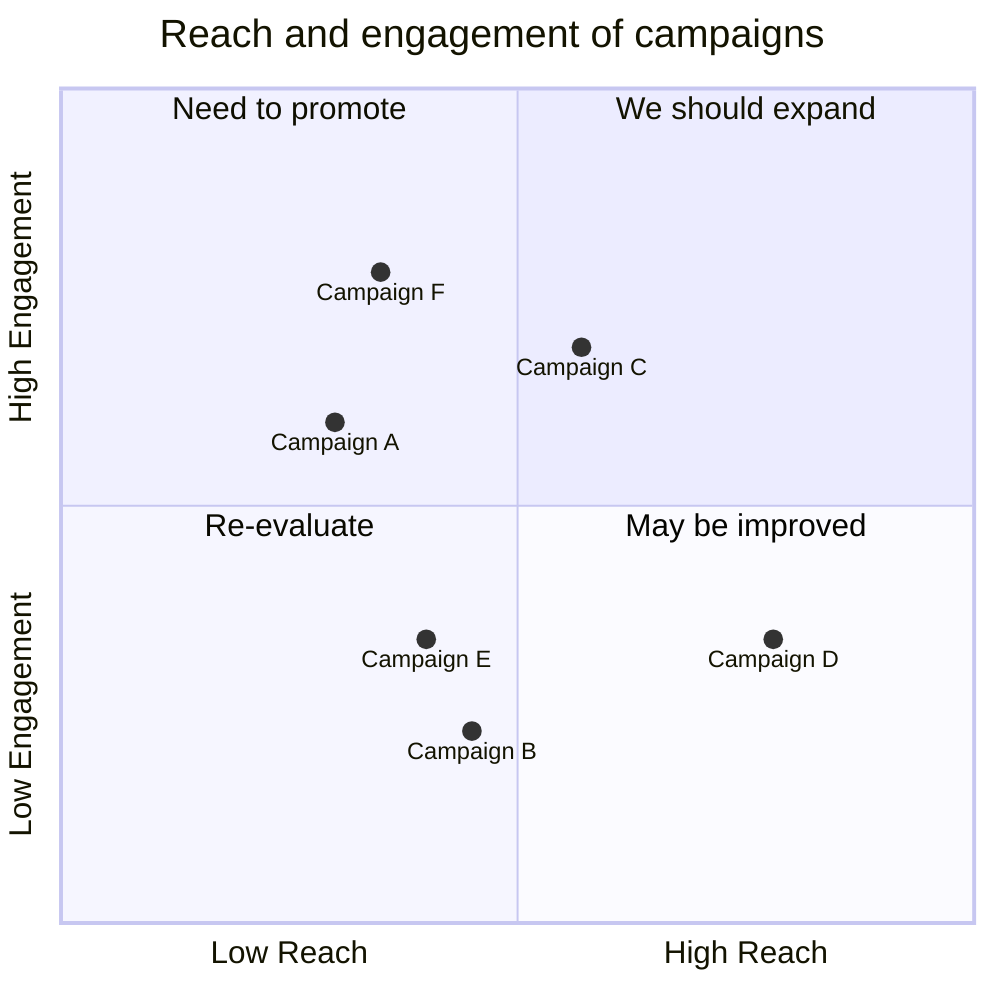
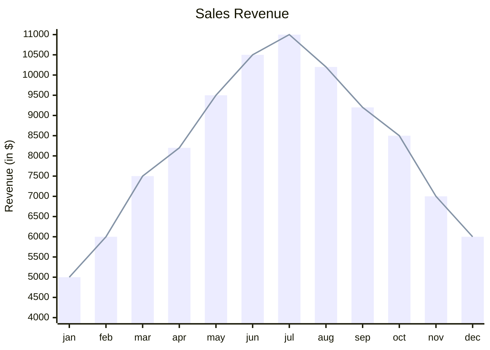

## Mermaid

它是一个基于 JavaScript 的图表绘制工具，可渲染 Markdown 启发的文本定义以动态创建和修改图表。

> 如果你熟悉 `Markdown`，那么学习 [Mermaid](https://mermaid.nodejs.cn/)  的语法 应该没有问题。

### 流程图

### 时序图

### 甘特图

### 类图

### Git 图

### 实体关系图

### 用户旅程图

### 象限图

### XY 图表

......
